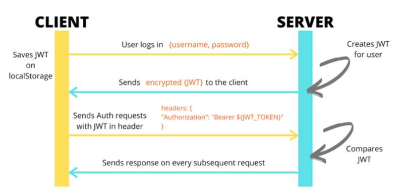

# 프로젝트 설명
이 프로젝트는 Spring Boot Security를 이용한 인증을 구현한 예제 프로젝트입니다.
### Authentication
- [x] Sign In / Sign Up with userName, password
- [x] Create Token with Username

---
### Authorization
- [x] Check if token exists in Authorization of HEADERS
- [x] Check if the token has expired
- [x] Make sure it starts with "Bearar"

# Endpoints
| 구분 | 기능                | METHOD | API |
| --- |-------------------| --- | --- |
| 로그인 | 단순 토큰 발급          | POST | /api/v1/users/join |
| 회원 가입 | 새로운 User 생성       | POST | /api/v1/users/login |
| 리뷰 작성 | 토큰을 받은 사용자의 리뷰 등록 | POST | /api/v1/reviews |

# 실행 방법
http://localhost:8080/api/v1/reviews 를 호출할 때

Header에 Authorization에 "Bearer </login에서 받은token>" 을 넣어서 요청 합니다.